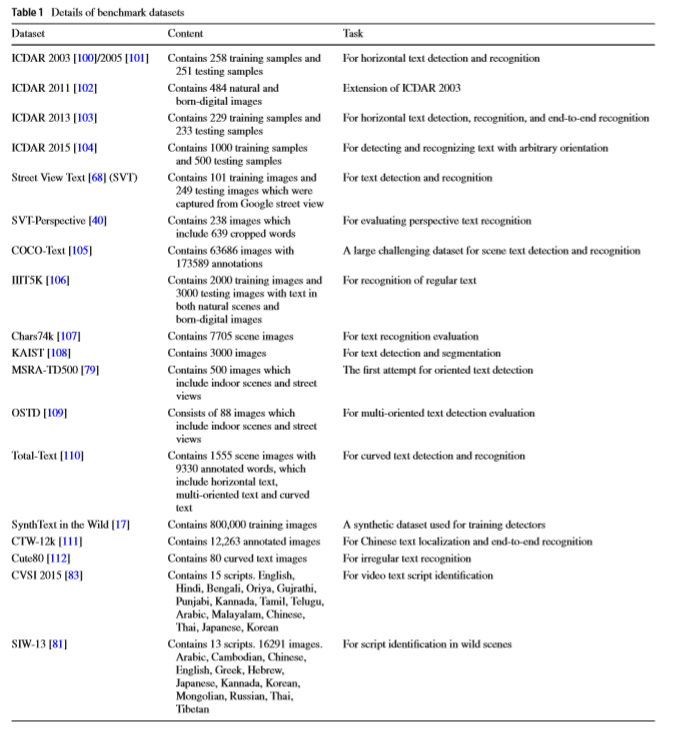
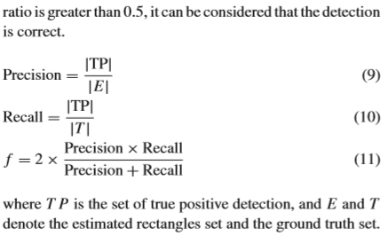
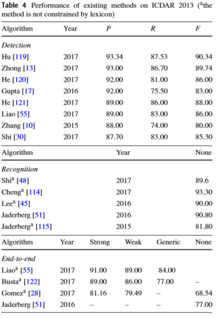
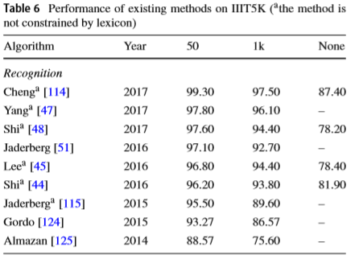
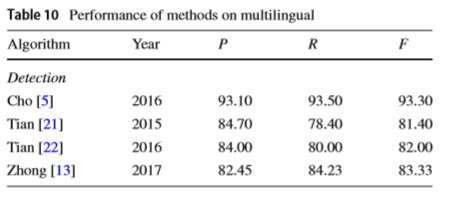

# Scene text detection and recognition with advances in deeplearning: a survey

# 摘要
- 近年来的热门话题
- 应用： 导航、帮视觉障碍人群阅读
- 深入回顾，重点关注近五年的文字检测识别方法，在图像、视频领域
- 相关的主题
    + 文字检测
    + 文字识别
    + 端到端文字识别系统
- 重点关注深度学习方法
- 简短介绍
    + 文种识别 
    + 文字/非文字分类
    + 文字到图像的检索
- 回顾总结基准数据集，基于基准数据集的state-of-the-art方法讨论
- 通过指出未来一些有潜力的方向作为总结

# 简介
- 自然场景文本检测识别的含义
- 应用
    + 交通监控
    + 多媒体检索
    + 自然场景的语义理解
- 技术分类
    + 文本检测
    + 文本定位
    + 文本识别
    + 端到端文字识别系统
- 相比文档中文字识别，场景文本检测识别更有在鲁棒性和准确性上更具挑战
    + 场景复杂性：噪音、变形、不统一照明、局部遮挡、文字和背景的混淆、复杂背景
    + 文字多样性：颜色、大小、方向、字体、语言、文字部分删除
    + 更严格的实用性需求：实时处理、鲁棒性增强

- 文字检测和识别领域有很多调查很不错
    + Neumann, L., Matas, J.: Scene text localization and recognition with oriented stroke detection. In: ICCV, pp. 97–104 (2013) 
    +  Jaderberg, M., Vedaldi, A., Zisserman, A.: Deep features for text spotting. In: ECCV, pp. 512–528. Springer (2014) 
    + Jaderberg,M.,Simonyan,K.,Vedaldi,A.,Zisserman,A.:Reading textinthewildwithconvolutionalneuralnetworks.IJCV116(1), 1–20 (2016) 
    + Neumann, L., Matas, J.: Efficient scene text localization and recognition with local character refinement. In: ICDAR’15, pp. 746–750. IEEE (2015) 
    + Neumann, L., Matas, J.: Real-time lexicon-free scene text localization and recognition. IEEE Trans. PAMI 38(9), 1872–1885 (2016)
    + Yao, C., Bai, X., Liu, W.: A unified framework for multioriented text detectionand recognition. IEEE Trans. Image Process. 23(11), 4737–4749 (2014)
    + Liao, M., Shi, B., Bai, X., Wang, X., Liu, W.: Textboxes: a fast text detector with a single deep neural network. In: AAAI, pp. 4161–4167 (2017) 
    + Ye,Q.,Doermann,D.:Textdetectionandrecognitioninimagery: a survey. IEEE Trans. PAMI 37(7), 1480–1500 (2015)
    + Zhu, Y., Yao, C., Bai, X.: Scene text detection and recognition: recentadvancesandfuturetrends.Front.Comput.Sci.10(1),19– 36 (2016)
    + Yin, X.C., Zuo, Z.Y., Tian, S., Liu, C.L.: Text detection, tracking and recognition in video: a comprehensive survey. IEEE Trans. Image Process. 25(6), 2752–2773 (2016) 
    +  Weinman, J.J.: Unified Detection and Recognition for Reading Text in Scene Images. University of Massachusetts Amherst, Amherst (2008) 
    + Field, J.: Improving text recognition in images of natural scenes. PhD thesis, University of Massachusetts Amherst (2014) 
    + Jaderberg, M.: Deep learning for text spotting. PhD thesis (2015) 
    + Mishra, A.: Understanding Text in Scene Images. PhD thesis, International Institute of Information Technology Hyderabad (2016) 

- 上面这些调查是前些年的，近五年的没有被包括和总结

#  先前方法总结
- 从方法论的角度，回顾先前方法分类
    + 传统OCR
    + 机器学习
    + 基于能量最小化的方法
    + 基于深度学习的方法
- OCR
    +  optical character recognition  专注为文档，photo-optical character recognition更具挑战
    + Bissacco 提出 photo-OCR system。 使用三种方法生成候选区域，包括深度学习方法，实验证明了他提出方法的优异性能
    + Neumann 提出real-time commercial OCR systems，使用了合成字体数据训练，提出字符标签的分类方法。
    + Lee 提出 lexicon-free photo-OCR system 结合了CNN和RNN 在基准数据集上达到 state-of-the-art 

- 能量最小化方法
    + 大多数的方法基于条件随机场（conditional random field，CRF）和马尔可夫随机场（Markov random field ，MRF）
    + Koo 把文本行抽取问题看成是能量最小化问题来解决文本行之间的干扰。
    + Mishra 基于CRF 提出了先进的能量最小化框架来识别文字。他们通过一元项和成对项将能量函数最小化，最终得到了图像的最优值
    + Shi 建立了CRF 来进行文字识别。
    + Bissacco 使用的三种技术中也有一种是能量最小化的。他们采用图切割来标记文本和非文本通过最小化马尔可夫随机场(MRF)与学习的能量项。
- 许多 CRF-based 或者 MRF-based 方法也可以看作是基于机器学习的方法。
    + Pan 设计了一个有监督CRF模型结合一元组件属性和二进制上下文组件来过滤非文本组件。
- 机器学习方法
    + SVM,随机森林和基于分类的方法
    + SVM是广泛应用的有效的分类方法
    + Neumann 选择 SVM model with RBF kernel 作为分类器
    + Lee 使用基于线性SVM分类器 排列挑选最最具信息量的特征来进行文字识别
    + Sharma 采用 Gaussian kernel SVM 分类器来确定语种使用 HMM进行词和字符的识别
    + Turki 基于HOG和CNN特征也训练了SVM 分类器筛选出了非文字元素。
    + Kang 提出了 higher-order correlation clustering（HOCC）进行文字检测。用structured SVM学习 HOCC的参数
    + Yin 采用了 single-link clustering algorithm 可以把字符候选聚合成文字候选。也采用AdaBoost 分类器确定文字候选和真实文字的对应关系。
    
- 尽管基于机器学习的方法在一些有挑战性的场景十分有竞争力，但是deep learning可以更容易的抽取更多特征。
- 情景文本识别极大的受益于基于深度学习的方法

# 近期的先进方法

- 在detection,recognition和端到端三方面在图像和视频两个应用场景讨论经典方法和深度方法。
- 基于深度学习的方法之间也会比较
- 也会讨论相关工作：文种识别、文字、非文字识别、文本二值化、文字到图像检索。

## 文本检测和定位
- 分类
    - connected component (CC)-based methods
    - texture-based methods 
    - deep learning-based methods
### connected component (CC)-based methods
- 找出小的部分组成大的部分，然后通过分类器去掉非文字部分，最终从图像中抽取文字并结合成文字区域。
- 优点：这些方法计算量小，效率高
- 缺点：受到一些限制，比如无法处理旋转、比例变化、复杂的背景和其他具有挑战性的情况
- CC-based中最具代表性方法
    + 最大稳定极值区域 maximally stable extremal regions(MSERs）
    + 笔划宽度转换 stroke width transform (SWT)
- Neumann 使用 MSERs 方法进行文字检测
    + 首先生成候选区域
    + 然后用已经训练好的字符和非字符分类器进行分类
    + 最终模型生成文本行
    + 它的新颖之处在于适应假设验证框架对多行文本进行训练，并使用合成字体对算法进行训练。

- MSERs 
    + 优点：提供了几何学和照明条件的鲁棒性
    + 缺点：只能处理水平或接近水平的文字

-  Epshtein 提出 SWT 方法
    + SWT是一种局部图像算子，它使用Canny边缘检测器进行边缘检测，计算每个像素最可能包含像素的笔画宽度
    + SWT输出一个图像，其中包含每个像素的笔画宽度值
    + 然后去除文本候选域的干扰
    + 对满足一系列条件的字符进行聚类，最终形成文本行

- SWT 
    + 优点：对文本检测很高效
    + 优点：可以检测多种字体和语言的文本，对多尺度和多方向不敏感
    + 缺点：需要许多人为定义的约束，因此在一些具有挑战性的情况下可能会失败。

- Yin 发展了基于 MSER 的方法
    + 首先，通过提出的 MSERs pruning算法进行抽取字符候选
    + 然后，采用单链路聚类算法将候选字符聚类为文本候选。
    + 然后，训练了一个字符分类器来剔除非文本候选。
    + 最终，采用AdaBoost分类器对文本进行检测
- MSERs pruning
    + 在低分辨率自然场景图像中检测多方向、多语言或高度模糊文本方面还有进一步的发展空间

- Neumann 提出的新方法将字符检测问题看作是从这些区域到极值区域的有效顺序选择 extremal regions (ERs) 极值区域。
    + 该方法占用内存少，计算速度快，保持了实时性
- 同样基于 extremal regions (ERs)，Cho 提出了可以检测各种文字的高效算法
    + 算法 通过 extremal regions 提取文字候选
    + 采用非最大抑制(NMS)方法保证了系统的唯一性和紧凑性。
    + 采用双阈值和滞后跟踪的方法，对低置信度的候选文本进行充分检测
    + 该方法优点：具有较高的查全率，缺点： 计算量较大。

- Busta 提出高效比划检测器，主要三个贡献
    + 将行程结束关键点(SEK)和行程弯曲关键点(SBK)引入到检测行程结束关键点(stroke keypoint)中，并利用它们产生行程分段。
    + 其次，他们训练了一个基于adaboost的分类器来分类文本碎片和背景杂波。
    + 最后，在文本方向投票的基础上，采用文本聚类技术对单个字符的文本行进行分组
    + 优点：除了计算速度快之外，这种方法是缩放和旋转不变的，并且支持多种脚本和字体
    + 缺点：在某些具有挑战性的情况下，如图像质量较低、字符比较紧凑等，这种方法可能会失败。

### Texture-based methods
- 基于文本方法的idea来源于图片有独特的文本组织特征，这个特征可以把文字和背景进行区分。
- 基于Gabor滤波器、小波、快速傅里叶变换(FFT)等技术可以检测图像中文本区域的文本特性
- 早在2000年，Zhong提出了提出了一种直接检测离散余弦变换 discrete cosine transform (DCT)域文本的滤波器
    + 运行迅速，但准确率相当低
- Hanif 提出了一种级联场景文本检测器和定位器。
    + AdaBoost分类器由线性判别分类器和似然比检验(LRT)组成
    + 在AdaBoost特征选择算法中考虑了特征的复杂性，提高了强分类器的复杂度和实时应用的计算复杂度
    + 采用一种基于神经网络的定位器自动学习定位规则。
    + 这种方法不适合各种尺寸和样式的文本检测
- Zhang 在观察字符组的对称性和自相似性的基础上，提出了一种基于对称的文本行检测器。
    + 该检测器能够直接从自然图像中发现文本行。
    + 该模型在ICDAR数据集中实现了state-of-the-art 的性能，可用于多语言检测。
    + 然而，其计算效率还有待提高。
- 梁等人提出了一种基于小波分解的任意方向特征分割算法。
    + 利用拉普拉斯小波对候选文本进行检测。
    + 此外，还提出了水平和垂直采样的概念来处理单词中的字符。
    + 该方法在精度和F值测量方面均有较高的性能。

### Deep learning-based methods
- CNN的主要优点是对几何变换、变形和光照不敏感，可以用很小的计算成本直接从图像中提取信息
- 由于cnn的先进性能，文本检测和识别在自然场景中的性能有了很大的提高。现有的基于cnn的方法大致可以分为几个子类:
    + 基于区域建议的方法  region proposal-based methods
    + 基于分段的方法  segmentation-based methods 
    + 使用多任务学习的混合方法  hybrid methods using multitask learning

#### Region proposal-based methods 
- 利用基于区域的方法和深度神经网络
- 这些方法可以通过cnn强大的分类能力和目标检测能力来鲁棒地学习组成成分的表示。
- HUang 在2014年 提出了一种鲁棒的场景文本检测器 结合了MSERs和CNN
    + 实验达到了ICDAR2011的最好效果
- zhong 等人结合更快的基于r-cnn的文本检测器和基于LocNetbased的定位模块，提出了一种提高定位精度的技术
    + 该方法能较好地满足复杂情况和多种语言的要求。
- Zhang 提出了一种可以在多个方向、语言和字体中检测文本的框架。
    + 它主要由两个全卷积网络(FCN)组成:一个用于text region的突出映射，另一个用于重写字符的中心点。
    + 然而，误报和缺失的字符会在某些情况下出现，比如对比度极低、曲线弯曲、反射光强、文本行太短或字符之间存在巨大的间隙。
    + 另一个限制是计算效率低。

- Zhu 提出了一种用于场景文本检测的级联系统。
    + 采用基于学习的卷积检测器 Text-Conv 对字符块进行检测。
    + 采用区域生长形成CCs。
    + Word Graph算法根据字符的外观和空间关系将检测到的字符CCs分组为单词。
    + 将上述技术结合在一起，将达到先进的性能。
    + 然而，该系统无法处理一些重叠的文本行、孤立的字符、不均匀的光照等问题。

#### Segmentation-based methods 
- 用来处理更精确的文本区域
- 但是对检测独立文本行和文字无效
- 基于分割的网络与检测网络相结合可以获得更好的性能
- 在此基础上，Qin 提出了一种基于卷积神经网络的级联方法
    + 一个是完全卷积的网络，叫做TextSegNet，它的目的是找到文本块
    + 另一个是名为WordDetNet的 YOLO-like 网络，它通过生成定向矩形区域来检测单个单词。
    + 该方法在提高ICDAR数据集的F-score方面做得很好

- Gupta等人开发了一种合成文本场景图像生成引擎来生成自然场景文本的图像。
    + 然后，构建了一个大型带注释的数据集，称为SynthText。
    + 受全卷积网络(FCN)的启发，提出了一种新的深度结构，即高精确度、快速、可训练的端到端全卷积回归网络。

- Tang 提出的方法采用级联卷积神经网络(CNNs)。在他们的工作中，提出了三种基于cnn的模型:检测网络(DNet)、分割网络(SNet)和分类网络(CNet)。
    + DNet用于检测文本区域或粗候选文本区域(CTR)
    + SNet在CTR细化和文本区域分割方面具有良好的效果
    + CNet是通过将CTRs分为文本和非文本来实现的。
    + 该方法利用深度CNN的强大功能，达到了具有竞争力的精度和最优的精度基准

- Wang 提出了一种新的字符候选提取方法基于超像素分割和层次聚类。
    + 受字符颜色一致性的恰当性启发，他们引入了一种超像素分割技术，该技术将颜色和边缘信息结合在一起，从而输出精确的超像素。
    + 通过单链路聚类提取候选字符。
    + 此外，他们还训练了一个具有双阈值策略的深度卷积神经网络(DCNN)分类器来对文本或非文本成分进行分类。
    + 在未来，它可以扩展到多连通字符检测任务。
    + 混合方法同时考虑了 CC-based 的方法和texture-based 的方法。这类方法通常使用多任务学习来优化参数。
- Turki 提出了一种高效、鲁棒的场景文本检测器。
    + 他们采用了Otsu方法和一个鲁棒的边缘目标来过滤复合背景。
    + 利用MSER 方法检测文本像素候选
    + 基于CNN和HOG特征, 使用svm来估计非文字元素。最后，根据文本块的几何特性消除了假阳性。
    
- Tian 提出了一种统一的场景文本检测系统，称为文本流Text Flow。该系统由两个关键步骤组成:
    + 一是采用级联增强技术的字符候选检测。
    + 另一种是使用最小成本流网络的文本行提取。
    + 最小成本流网络能够将三个顺序步骤(伪字符删除、文本行提取、文本行验证)集成到一个流程中。
    + 这种方法估计了错误的累计，有很高的召回率
    + 然而，它的速度并没有提高，而且在一些具有挑战性的条件下也无法检测到结果

- Tian等人提出了一个框架，称为Connectionist Text Proposal Network (CTPN)，用于在野外对文本进行本地化。
    + CTPN是端到端的训练，可以扩展到多语言、多尺度的文本检测。由于两个关键贡献，该模型实现了最先进的结果。
    + 一种是垂直锚定机制，通过联合预测每个文本提案的位置和文本/非文本评分来提高定位精度。
    + 另一种是网络内递归神经网络，用于连接顺序文本提案
    + 通过这种方式，该模型能够处理最具挑战性的情况下的检测

- He等人提出了一种新的文本注意力机制卷积神经网络(text-attention convolutional neural network, Text-CNN)
    + 该神经网络能够有效地从图像组件中提取与文本相关的区域和特征。
    + 上述两方面的贡献有效地提高了检测精度和召回率。
    + 然而，它在某些情况下失败了，例如极其模糊的文本。
- Fabrizio 提出上下文无关的检测技术 没有像大多数现有方法那样的大量假设。
    + CC-based method 是用来生成文字候选的
    + Texture-based 方法对生成的候选文本进行验证或丢弃
    + 这种方法适用于多尺寸、多方向的文本。
    + 然而，可能由于较少的假设而发生假阳性，而且当字母粘在一起时，无法将它们分开。

## 文本识别
- 文字识别建立在检测正确的基础上
- 分类
    + character-based methods
    + word-based methods
    + sequence-based methods
- 值得注意的是，在第一次工作（Shi 发表在2017 IEEE Trans）之后，用于识别序列状文本图像的CNN+RNN框架非常受欢迎，它比以前的方法有许多改进。

###  Character-basedmethods
- 基于字符的方法执行字符级文本识别。文字作为文本的基本要素，承载着大量的重要信息。字符识别的成功使得自底向上的文本识别更容易实现。
- Yao 提出了一种用于场景文本识别的高级多尺度表示，称为 strokelets。
    + 其本质是一组多尺度的中层原语，可以通过包围框标签自动学习。
    + strokelets的主要优点是多折叠，可以概括为可用性、鲁棒性、通用性和表达性
    + 该方法具有良好的字符描述能力和鲁棒性。
- Lee等人致力于字符识别，提出了一种判别特征聚类方法。
    + 首先，他们提取了包括梯度直方图、梯度大小和颜色在内的低层特征。
    + 其次，对提取的底层特征进行了基于特征集的自动集成。
    + 最后，设计了一种基于svm的线性分类器。该特征被证明是紧凑的，计算效率高，可以有效地建模每个个性的独特空间结构。

- Lou 设计了一种场景文本认知生成模型。
    + 该方法在训练数据很少的情况下，实现了对ICDAR数据集和SVT数据集的研究。
    + 为了应对字体在野外变化的挑战，他们采用了一种贪婪的方法来表示字体的选择
    + 此外，他们选择了 max-margin 结构化输出，学习训练一个能够让人满意地推断真言的解析模型
    + 然而，在模糊和过度曝光的情况下，这种方法可能会遗漏边缘证据。

###  Word-based methods
 - 基于词的方法也引起了许多学者的关注,已有的一些方法将单词识别作为一个优化问题
 - Phan 为了识别任意方向的透视场景文本，提出了一种先进的文本识别方法。
    + 通过在关键字包框架中使用稠密SIFT，可以较好地识别字符。
    + 在不考虑语言认知的情况下，他们采用了一种优化的对齐算法。 
    + 值得注意的是，整个系统只训练了前端特征，大大降低了对前端特征的要求
- Weinman等人提出了一种阅读系统。
    + 他们在概率框架下将分词和识别结合起来。
    + 采用词法决策和稀疏波束搜索工具，提高了识别精度和运算效率。

### Sequence-based methods
- 近年来，许多文献将文本识别问题归结为一种序列识别任务，其中文本通过字符序列表示。
- 基于序列的方法考虑字符之间的密切关系
- Shi 提出了不规则文本识别方法,称为RARE(Robust text recognizer with Automatic REctification)
    + 模型结合了 spatial transformer network (STN) 和 sequence recognition network (SRN)
    +  STN  把输入图像变成整流图像； SRN用来识别文字
    + 采用基于注意力的模型对STN框架和SRN进行扩展
    + 该方法能显著提高非规则文本的识别率
    + 但在某些具有挑战性的情况下，如视角失真较大或曲线角度较大的文本，往往会失败。

- Lee 提出了一种 lexicon-free photo-OCR system，称为带注意力机制的递归神经网络(recursive recurrent neuralnetworks with attention modeling，R2AM)。
    + 使用 recursive CNN 捕获图像的特征，因为它能以提高CNN的深度，并积极响应提取的特征。
    + 采用RNN对文本的字符级统计量进行建模。
    + 此外，为了迫使模型更多地关注输入特征中最重要的部分，他们在方法中选择了软注意模型（soft-attention model ）。

- 针对基于图像的序列识别问题，Shi 提出了一种端到端的文本识别系统，称为卷积递归神经网络(convolutional recurrent neural network , CRNN)
    + 构成： convolutionallayers,recurrentlayers and transcription
    + 结合了CNN和RNN 
    + 处理任意长序列 不依赖附加的lexicon
    + 有竞争力的表现和更小的参数量

- He 设计了一种深文本循环网络(deep-text network, DTRN)，该网络将场景文本识别看作是一个深度序列标记问题。
    + CNN + RNN结构
    + CNN 提取特征，RNN 学习序列模型
    + 很好地处理未知单词、任意字符串和多个单词，而不需要任何预定义的字典。

- Yang 致力于不规则的文字识别，提出了一种由辅助密集字符检测模型和注意模型组成的端到端模型
    + 前者是一个FCN，学习高位特征表示
    + 后者使用对齐损失 alignment loss
    + 通过以上两部分的结合，该模型取得了较好的竞争效果。

## 端到端文本检测系统

- Jaderberg 提出了一种新的卷积神经网络(CNN)结构来生成一系列显著性映射。
    + 基于cnn的分类器可以处理整个图像，而不是裁剪后的图像。
    + 此外，为了获取更多的训练数据，他们提出了一种自动数据挖掘技术，可以从Flickr 生成带注释的word和character级数据。
    +  state-of-the-art performance 在多个数据集

- Jaderberg等人通过以下工作，最近提出了的文本识别方法。
    + 将边缘盒区域建议方法与聚合通道特征(ACF)检测器相结合，检测结果显示召回率具有较强的表现。
    + 他们设计了一个分类器来过滤假阳性边界框，以减少计算成本
    + 并训练了一个回归器来细化边界框的位置。
    + 受全字图像算法的启发，他们训练了一个只用合成数据的新型深卷积神经网络

- Neumann 做了大量的研究，有效地推动了该领域的进展。

- Neumann 利用滑动窗口和连接组件方法的优点，提出了一种不受约束的端到端实时文本定位和识别方法。
    + 模型通过条状过滤器检测比划
    + 此外，它们还引入了一个健壮的字符表示
    + 然而 在检测过程有许多限制 eg:一个字符的子区域可能是另一个字符，字母在边界上只有一个笔画

- Neumann 开发了端到端实时系统。
    + 我们设计了基于区域的方法来检测单个阶段的初始文本假设，
    + 然后使用一个更健壮的局部文本模式来细化文本行假设
    + 介绍了另一种基于笔画支持像素 stroke support pixels (SSPs)的特征，这种特征不受缩放和旋转的影响。
    
- Neumann 提出先进的端到端实时检测识别系统，不用任何先验知识
    + 提出了字符检测问题是一种高效的从这些区域到极值区域extremal regions（ERS）的序列选择问题，实现了实时性。
    + 该方法不受噪声、低对比度、色彩变化等干扰因素的影响。

- Yao 首先提出了一种多方向文本的端到端识别方法
    + 基于随机树的层次特征及其内在的聚类机制的区分能力，该组件级分类器在文本检测和识别方面取得了较好的性能
    + 此外，还设计了一种基于字典的搜索方法来纠正错误识别

- Liao 提出了TextBox模型，一种端到端的文本检测和识别模型。
    + 该模型在保持效率的同时实现了具有竞争力的
    + 全卷积网络提取特征来确定检测区域，CRNN用于识别文字
    + 他是是目前端到端文本识别和单词识别的state-of-the-art 结果。

## 情景视频文本检测和识别
- 视频文本包含重要的高层次信息，有助于基于内容的视频理解和检索。
- 然而，与图像文本相比，视频文本的检测和识别更具挑战性
- 它的显示形式可以分为
    + 分层标题文本
    + 嵌入标题文本
    + 场景文本

- 嵌入式文本对视频帧的语义信息具有良好的方向性和概括性。
- Tian 为嵌入式文本提出了统一框架
    + 它是一种基于贝叶斯算法的文本检测方法
    + 包括多分量子串跟踪、基于跟踪的文本检测和跟踪文本识别

- 对于视频中的场景文本，背景通常比较复杂，帧的分辨率也较低
    + 因此，传统的场景图像检测技术无法有效地解决文本检测和视频帧识别问题。
    + 为了克服这些问题，提高视频场景文本检测和识别的性能，许多方法都采用了时空信息。

- Shivakumara 提出了一种多方向文本检测视频的方法
    + 他们使用傅里叶-拉普拉斯滤波来识别候选文本区域
    + 基于相交点的个数区分 simple CC and complex CC 
    + 骨架化被用来将CCs分割成文本行
    + 为了消除假阳性，最后使用文本串的直线度和边缘密度
    + 该方法具有较高的查全率和F值

- Liang 提出了一种在频域内对拉普拉斯算子与小波子带进行多层卷积的新思想。
    + 他们采用MSER和SWT将候选文本像素分组为文本区域
    + 然后采用相互最近邻聚类的方法对属于同一文本行的候选文本区域进行聚类。
    + 这是一种非常有效的任意方向文本检测方法
    + 在场景图像检测和视频文本检测中都取得了良好的精度
- Yousfi 基于CNN 探索了三种深度学习模型来提取阿拉伯语视频特征
    + Deep belief networks 能以分层的方式学习权重，被用来学习字符重构
    + deep auto-encoders based on multi layer perceptron 使用基于深度自编码的多层感知器学习字符重建，用来学习字符重建
    + 采用卷积神经网络学习特征分类的充分表征
    + 最终， 采用 BLSTM-CTC网络预测文本转录

- Sharma 提出了一种多语言视频文本识别的新技术。
    + 采用基于空间金字塔匹配(SPM)的池化方案，结合SIFT描述符和SVM分类器进行文种识别
    + 并采用隐马尔可夫模型(HMM)进行单词和字符识别。
    + 最后，他们利用基于词汇的词识别结果后处理来提高识别结果的准确性

## 多方向文本检测
- 近年来，针对多方向文本检测的研究越来越多，这似乎是近年来文本阅读in Wild的发展趋势。
- 与通过各种方法成功检测到的水平或近水平文本相比，面向多方向的文本检测任务更具挑战性，有很大的改进空间。
- 为了提高多方向文本检测器的性能，提出了多种方法。
- 在早期的工作中，Yin 首先提出了一个统一的距离度量学习框架。
    + 在此基础上，应用了一种粗到精的文本候选结构分组算法，实现了一种高效的场景文本检测。
    + 该方法在多方向文本检测中表现优异，但在低分辨率图像中对严重模糊的文本检测能力较弱。

- Yao 提出了一种对任意方向文本检测的技术
    + 使用了SWT、 组成成分特征、链级别特征等
    + 使用两级分类 减少手动参数的影响
    + 实验结果表明，该方法在多方向文本检测中具有较好的性能。
- 基于MSER, Kang等人提出了针对任意方向文本的高阶相关聚类(HOCC)。
    + 具体来说，受MSER空间对齐和外观一致性的启发，首先提出了弱假设。
    + 然后，他们使用HOCC将mser划分为文本行候选项。
    + 最后，利用文本分类器对非文本区域进行过滤。
    + 他们创造性地将文本检测作为一种图形划分问题来处理，成功地实现了多方向、多语言、多字体的文本检测。
    + 然而，该方法需要一些先验知识和假设

- Gomez等人提出了一种基于文本的对象提议算法。
    + 与现有的对象提案方法相比，该方法虽然只提取了几千个提案，但在提高召回率方面做得很好。
    + 他们将提出的文本建议算法与其他全词识别模型集成在一起，从而在端到端场景词识别任务中实现了 state-of-the-art 的性能。
- Zhou  设计了一个快速、简单但功能强大的框架，用于检测多方向和多四边形文本  EAST
    + 检测流程由两个阶段组成:
    + 一个是全卷积网络(FCN)模型，用于产生字级或行级预测;
    + 另一个是产生检测结果的非最大抑制(NMS)过程。
    + 该模型在性能上优于以前的先进方法，但运行速度要快得多。
    + 然而，由于训练集大小的限制，该模型在检测长文本时受到限制。
- Shi 提出了一种先进的面向多方向的文本检测方法分割连接(SegLink)
    + 包含两个元素 ： segments and links
    + 前者是一个有朝向的框，它覆盖单词或文本行的一部分。
    + 后者用于连接一对相邻的分割部分，并表示它们属于整个文本行。
    + 此外，他们还设计了一个全卷积神经网络来检测线段和链路。
    + 虽然有这个模型有些限制(例如，两个阈值需要手动设置，不能自动调整;字符间距会影响检测性能）充分的实验表明，该方法具有较高的检测精度和效率。

- 基于CNN, Liu等人提出了深度匹配先验网络(deep matching prior network, DMPNet)。
    + 然后，提出了计算多边形重叠区域的共享蒙特卡罗方法。
    + 特别是，人们采用了一种新颖的顺序协议和相对关联协议，允许使用四边形而不是矩形来实现文字定位。
    + 但是，该窗口是手工设计的，可能会影响模型的性能。

## 预处理和延申
- 在场景文本阅读系统中，有一些相关的研究任务起着至关重要的作用。
- 我们主要关注文种识别、文本/非文本分类、场景文本二值化以及视觉和语言。

### Script identification
- 文种识别是一个重要步骤，旨在确定文本的语言类别。
- 在某些情况下，由于不同的文种(如中文和英文)在结构上有很强的区别，许多现有的文本检测和识别技术无法在多语言上有效运行。
- 然而，一些文种在类间有很强的相似性，这不利于区分，从而给阅读系统带来了更多的挑战。
- 因此，一些方法有助于文种识别的发展。

- Nicolaou 提出了一种用于视频文本、场景文本和手写文本的高级文种识别方法。
    + 该方法利用人工神经网络对光栅文本特征进行手工处理。
    + 实验表明，该模型实现了CVSI 2015 视频文种识别数据集和SIW数据集的state-of-the-art效果。

- Shi 开发了一种用于野外文种识别的技术。
    + 他们选择deep network作为基本框架，提出了有区别卷积神经网络(DisCNN)
    + 它具有区分脚本和细微差别的能力。
    + 在他们的方法中，带有区分的id级代表的深度特征被用来训练深度网络
    + 此外，他们还收集了一个名为SIW-13的大型文种数据集，其中包含16291张图像，13个文种
    + 这些方法在许多数据集上展示出有竞争力的表现。
    + 一些场景表现不佳：模糊或低分辨率的图像，不同寻常的文本布局和具有相似外观的文本 

- Gomez 提出了一种 CNN-based 的方法，该方法能够在基于patch的分类框架通过结合卷积网络，
学习区分的笔画部分表示及其相对重要性
    + 更具体地说，基于patch的分类方案是为了在识别脚本的同时处理文本的高宽比变化非常大的问题。
    + 该模型在三个基准数据集中进行了评估，优于以往的大多数方法。
- 此外，我们还介绍了几种广泛使用的脚本识别数据集，包括场景文本和视频文本。CVSI 2015和SIW-13

 ### Text/non-text classification
- 目的：从大量文本中挑选出含有文字的文本
- 它可以看作是文本检测和识别过程中不可避免的预处理。
- 由于文本的外观、复合背景和对时间复杂度的特殊要求，这种分类具有挑战性。
- 一些方法
    + Delaye 基于CFR的手写文本分类器
    + Phan 提出RNN-based 分类器 来处理text/non-text 的分类
    + Sharma 重点介绍视频中的文本/非文本分类。
- bai 致力于 text/non-text 图像分类
    + 他们提出了一种基于cnn的多尺度空间划分网络 (MSP-Net).
    + 在这种方法中，他们预测图像是否具有块级别的文本内容。
    + 只要图像的一个块中存在文本，则认为它是文本图像;否则，它就是一个非文本图像
    + 设计了一种高效、鲁棒的神经网络结构，该结构在典型故障、光照不足、规则曲线等情况下均能取得良好的性能。

### Text binarization
- 在文本检测和识别的预处理中，二值化也扮演着重要的角色。
- 文档图像二值化的目的是将文本从背景中分离出来，有助于文档图像的分析和识别。
- 方法分三种：
    + threshold methods 
    + clustering-based methods
    + energy minimization methods 
- 文档图像的二值化是一项非常具有挑战性的工作，因为它会产生不:均匀的阴影、纸张老化引起的噪声、污渍、流血和纸张折痕等。

- 近年来，针对文档图像二值化的挑战，人们提出了许多方法。
- Tensmeyer 提出了一种基于fcn的文档图像二值化技术
    + 此外，他们还发现相对黑暗relative darkness(RD)特征 作为 额外的输入特征表现得最好。

- Peng 提出 将深度卷积神经网络(DCNNs)与深度转置卷积神经网络deep transposed convolutional neural networks (DTCNNs)相结合。
    + 采用基于cnn的模型，采用编解码器结构，对文档图片进行二值化。
    + 采用一个完全连通的条件随机场重新标记置信度图，提高二值化文档图像的质量
- Meng 提出了基于dcnn的文档图像退化二值化方法
    + 他们设计了一个编码-解码器网络架构来产生精确的二值化结果
- Wang 基于MRF ，提出了一种考虑文本笔画特征并自动生成种子像素的二值化方法。
    + 通过收集不同权重的种子，可以获得高度置信度的聚类中心。

### Vision and language
- 自然图像中的文本通常会增加场景的语义信息，因此将场景中的文本与视觉线索相结合有助于图像分类或检索。各种方法都致力于这一领域的探索。
    + 早期，Ha 提出了一种基于文本到图像的文本视觉关联模型，该模型加入了超网络(HN)模型，并与学习模型进行了跨模态查询扩展。

- Mishra  提出了一种基于查询的文本-图像检索方法。
    + 首先对图像中的文本进行近似定位，并对数据库中的一组词汇进行索引。
    + 然后，他们根据字符的存在程度计算分数。
    + 最后，利用无脊椎动物的检索功能进行检索，利用空间排序和空间定位功能对其进行排序。
- Karaoglu 专注于细粒度分类和业务标识检索，将文本信息和视觉线索结合在一起。
    + 他们提出了一个双目文字水平的建议，其中包括步骤。
    + 前者用于定位图像中的文本，而后者则以单词proposal作为识别器的输入，生成单词级表示。
    + 此外，他们认为召回率更有利于细粒度分类和标识检索。
- Rong 主要研究文本定位和检索无歧义场景。
    + 他们建议使用recurrent dense text localization network (DTLN)
    + 将CNN的特征解码成一组可变长度的文本实例检测。
    + 然后，将DTLN的输出输入另一个提出的模型——上下文推理文本检索context reasoning text retrieval (CRTR)，该模型用于通过自然语言检索场景文本实例。他们还收集了一个明确的文本实例检索数据集进行评估。

#  评估和比较

- 在本节中，我们主要有以下三个任务。
    + 对广泛使用的基准数据集进行了列举和分析，
    + 并对评估协议进行了讨论。
    + 最后，我们进一步展示和比较了一些先进技术在公共数据集中的性能。

## Benchmark datasets
- 作为近年来最受欢迎的比赛之一，“鲁棒阅读”比赛提供了ICDAR数据集(2003/05/11/13/15)
- ICDAR数据集是包括图像和视频文本在内的常用数据集

## Evaluation protocols 

### 拉丁文本评价标准
#### Evaluation protocol for text detection 文本检测评估协议
从2003年ICDAR的稳健阅读比赛可以看出，ICDAR的评价体系是基于准确率和召回率的。
- 矩形r和矩形R的最佳匹配定义如下：

- 精确率和查全率定义（T是ground truth,E是估计的矩形）：

- 采用精度和重算值的加权谐波平均值作为标准F测度F，对文本检测的性能进行了评价。阿尔法代表权重，通常取0.5

- 在ICDAR鲁棒性阅读比赛ICDAR 2011和ICDAR2013中，采用Wolf方法对场景文本检测方法进行评估。这个评估指标考虑了一对一匹配、一对多匹配和多对一匹配。精度、查全率和F测度F定义为

#### Evaluation protocol fortext recognition 本识别的评估协议
- 要评估单词认知的准确性，使用编辑距离，删除、替换和插入的成本相同。
- 通过对地 ground-truth 文本的长度进行归一化编辑距离，计算出 ground-truth 与f翻译之间的归一化编辑距离。

#### Evaluation protocol for end-to-end system 端到端系统评估协议
- Karatzas 提出改进的协议
- 该评价策略既考虑了文本检测的效率，又考虑了通过精度、查全率和F测度进行文本识别的能力。

### 非拉丁字评估协议
#### MSRA-TD 500评价方案。
- 由于数据集包含水平文本和倾斜文本，重叠比定义如下:

#### Evaluation protocol for RCTW
- 文本定位采用AP作为主要评价指标。此外，F值的计算也与以往的比赛结果相吻合。
- 需要注意的是，相交过度并集(IoU)是在多边形上计算的，而不是在矩形上计算的。
- 对于端到端识别，计算平均编辑距离(AED)来评价方法的性能
- 较低的AED意味着更好的性能。
- 为了与其他比赛相适应，他们还计算出了如下的标准
 

## 算法性能
- 一些 state-of-the-art 算法
- P,R,F 分别表示精确率 召回率 F值
- 50”和“1k”是lexicon大小、“Full”表示基准中所有图像的组合词汇，“None”表示无lexicon
- 值得注意的是，“strong”指的是每个图像包含100个单词的lexicon;“weak”是指包含所有测试集单词的lexicon;“generic”是指包含90k个单词的lexicon。

### Performance of scene text detection
- 利用icdar数据集，目前主流方法的精度已超过90%，而recall和F measure还有进一步提高的空间。
- 我们可以看到，现有的大多数方法在COCO dataset和SVT上的性能仍然不是很理想，因为它们具有极大的挑战性。
- 许多基于cnn的方法是非常有竞争力的，并达到了最先进的性能不变的基准
- 此外，连通分量在该领域也发挥着关键作用，Yin 、Neumann 等CC-based的方法也能很好地工作。

- 此外，我们还介绍和分析了 zhou，Liao，Shietal等以前的技术状态方法的效率，快速检测文本。在保证模型性能的同时，大大减少了计算时间，有利于模型的实际应用。

### Performance of scene text recognition
- Cheng 和Jaderberg 提出的基于cnn的方法在ICDAR2003、SVT和IIIT5K中表现最好。该方法将文本框和CRNN相结合，实现了最先进的文本定位和端到端文本识别性能。此外，CNN+RNN框架在之前的许多方法中都很受欢迎。

### Performance of end-to-end system
Gomez 在SVT、IC03-50和IC03-Full中表现优于其他技术。liao 提出了TextBoxes，并在ICDAR2013中取得了最好的性能。同样，基于cnn的方法也占有重要地位。

# 讨论
- 本文从方法论的角度对场景文本检测与识别进行了基础性的研究。
- 近年来，许多方法都经历了巨大的努力和进步。
    + 基于连接组件(CC)的方法
    + 基于文本的方法
    + 基于深度学习的方法。
- 其中最具代表性的基于cc的方法是MSER和SWT，它们是各种最先进方法的基础。
- 随着深度学习的快速发展，大量的方法采用神经网络，取得了良好的性能。
- 此外，面向多方向的文本检测因其更具挑战性和实用性而受到越来越多的关注。
- 在场景文本识别方面，CNN+RNN框架较之前的方法有了很大的进步，非常受欢迎。
- 此外，许多方法将文本识别问题作为序列识别任务。
- 与文本检测或识别相比，端到端系统更具挑战性，但具有直接的实用价值。
- 最后，脚本识别、文本二值化、文本/非文本分类和文本到图像检索等在文本阅读系统中也发挥着重要作用。

- 几个潜在的趋势
    + 复杂场景和大数据集:由于COCO数据集背景复杂、文本多样，以往的方法在COCO数据集中效果不佳。因此，构建一个能够满足多个挑战性案例的系统将成为研究的趋势。
    + 多语言检测与识别:在某些情况下，不同的语言可能出现在同一个场景中。由于不同的语言在笔画结构上有很强的差异(如汉语和英语)，现有的许多技术都不能很好地进行多语言检测和识别。因此，一方面，我们可以先进行文种识别，然后形成特定的模型，分别检测和识别每种语言。另一方面，也有一些技术，例如Textflow可以通过统一的模型检测多语言。
    + 实时检测与识别:随着移动设备的爆炸式增长，实时处理视频数据的需求越来越大。在这项任务中，关键问题是优化运行速度和节省存储，然后建立一个先进的端到端系统，提高实时性、准确性和鲁棒性。当然，其他一些应用程序需要实时处理，比如交通监控、web视频和卫星地图。
    + 视觉理解:视觉与语言是与场景文本检测与识别相关的一项有趣的工作。从场景中提取文本线索，识别文本有助于阅读和理解场景。一些方法侧重于通过文本线索进行图像分类和检索。例如，Mishra 提出了一种基于查询的文本-图像检索方法。为了将文本信息和视觉线索结合起来，处理细粒度分类和业务标识检索。

# 总结
略