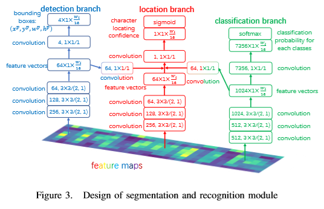

# A Fast and Accurate Fully Convolutional Network for End-to-end Handwritten Chinese Text Segmentation and Recognition

# 摘要
- HCTR方法分类
    + over-segmentation
    + HMM
    + LSTM-RNN
- 问题
    + 单个字符分割准确度低
- 实验数据
    + CASIA-HWDB 
    + ICDAR 2013
- 结果
    + 表现优异
    + 70fps

# 介绍
- 先前方法
    + over-segmentation
        - 不能端到端训练
    + HMM 
    + LSTM-RNN and CTC
        - 不包含分割信息
- 当前检测方法
    + two stage 
        - 第一步，区域提议（RPN）
        - 第二步，分类
    + one stage  
        - 把检测当成回归任务
- 本文方法
    + 同时产生 字符分割 和 识别结果
    + one stage 方法
    + 和 over-segmentation 方法比 降低分割难度
    + 和HMM 和LSTM-RNN 比，它们只能识别不能分割
    + 可以应用于擦出敏感信息
- 表现
    + 70fps
    + 没有LM 89.61% AR, 90.62% CR 
    + 有LM 94.88% AR, 95.51% CR 
    + 分割 F-measure  93.44%  在 CASIA-HWDB2.0-2.2

# 方法

## 总体结构

- CNN 在多个领域取得成功
    + 图像分类
    + 物体检测
    + 语义分割
- 选择cnn原因
    + cnn表现出众
    + 中文字符对长宽比有要求
    + 全局信息不重要，大小合适的局部信息很重要
    + cnn 快，能保持长宽比提取局部信息
    + 因此和全连接lstm相比,全卷积更适合HCTR
- 整体流程
    + 高度归一化为 128px
    + backbone网络是卷积和残差网络
    + 4个strides {2，4，8，16} 倍缩小
    + backbone后是三个分支
        - detection
        - location
        - classification
    + 三个分支 Segmentation and Recognition Module（SRM）

## 骨干网络
- 设计灵感来源于残差网络
- 残差网络包含一系列的 3x3核 和残差模块
- 每个卷积层都做 batch normalization 使用 leaky ReLU 激活函数
- 假设输入长宽 128 x wi，处理流程如下图所示
- 每个长方形表示带残差的模块
- 带有降采样的残差模块意味着在加法操作之前，输入模块将会被 kernel size 为 3,stride 为2 的卷积层降采样

## 分割和识别模块（SRM）

- 三个分支：location, detection and classification 
    + location 指示字符位置信息
    + detection 预测假借区域坐标和形状
    + classification 识别字符
- 和自然场景不同 文本行中字符分布在一个维度
- 因此在 三个 3x3 卷积之后，stride(2,1)， 高度变成 1px，宽度不变，产生许多一维特征向量
- 特征向量长度命名为Lfv = Wi/16
- 用Lfv个水平格子做预测
- 和yolo不同的是，我们的长宽比0.125当投影到原来的图像时，因为不同stride的卷积
- 水平方向是稠密的，垂直方向只有一个格子，这阻止了多余的预测和计算

### location
- 预测在哪个格子中很重要，是决定整个模型表现的关键
- 三分支不同任务但高度相关
- decetion和classification结果可以帮助决定location信息
- 因此 decetion和classification 的 feature vector 经历一个 1x1 卷积加到location分支中，包含上下文信息。
- 可视化结果显示，加了decetion和classification特征的结果表现出更高召回率和准确率。

- 新向量通过 1x1 卷积后是长为Lfv的卷向量lp，在lp上应用sigmoid 函数,我们得到位置置信度向量Lp。
Lp的每一个元素指示了location对应的网格
-我们在location分支上采用 binary cross entropy loss
- 如果字符的中心在格子里，那么字符就在这个格子里。
- 格子比字符更稠密，负样本更多。
- 正负样本的loss被分别平均。

### detection
- 字符的宽高和文本行图像的高是相关的。
- detection分支直接预测字符的高和宽关于文本行高的比例，更有效。
- 预测中心点关于左上角顶点的偏移（和yolo一样）
- 第i个检测结果是

- 边框转换到原图像的公式

- H,W 表示原图像的宽和高，损失函数使用均方误差
- 只有框里有字的才用来计算误差
### classification
- 中文字符 7356类，需要更多特征向量
- 使用 7356个通道的卷积层，从1024个特征向量 -> 7356*Lfv矩阵
- 在softmax操作之后，每个格子都输出7356类的可能性。

## Transcription

### 没有LM
- 结合位置信息和语言模型
- NMS 通过x的坐标
- 识别的结果是筛选出的边框的标签序列，筛选出的候选框是分割结果

### 有LM
- 三语言模型
- 使用搜索方法获得结果

## 实验

### 数据集
- CASIA-HWDB
- ICDAR 2013

### 数据处理

- 倾斜角度估计
    + 黑色像素是数据，线性回归
    + 斜率 a 倾斜角 -arctan(a)
- 旋转
- 移除空白
- 缩放
    + 使得高度为128px

### 数据增强
- 生成了200,000 个字符文本在 CASIA-HWDB1.0-1.2上
- 字符个数是长为26标准差7.5的正态分布，类别随机选择

### 训练策略
尽管我们在综合数据中加入了随机特性，但是它的空间分布和真实数据还是不一样。因此，我们只用它来提升分类分支

### 正确率

- 识别
    + 在CASIA-HWDB2.0-2.2和综合数据上训练
    + 验证了SRM三分支的高效性

- 分割
    + 结果并没有更好
    + 但是更快
    + 不需要预训练

### 速度
- 70fps
- GTX1080ti
- 短图片比70fps快

## 结论
略

# todo
- " 因此 decetion和classification 的 feature vector 经历一个 1x1 卷积加到location分支中。" 为什么 要再卷积？
 
 - "只有框里有字的才用来计算误差" 啥意思

 - AR,CR怎么理解
