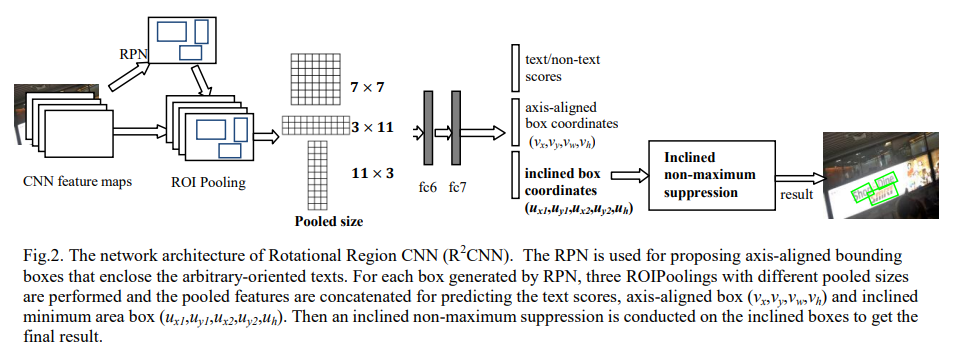
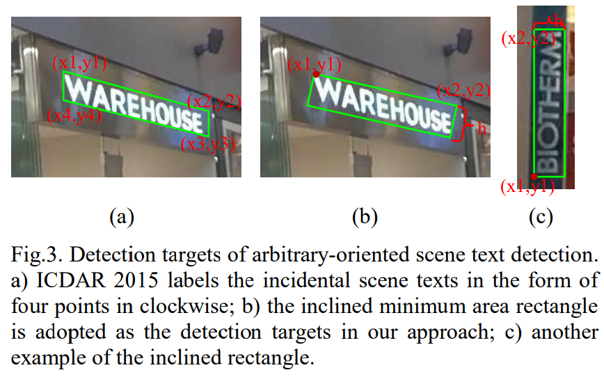
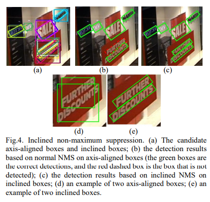
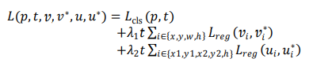
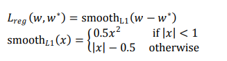
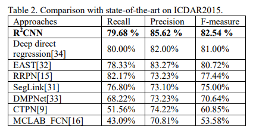
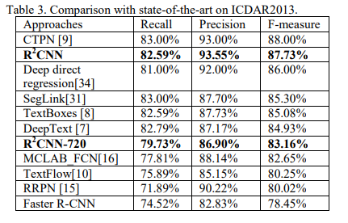

# R2CNN

## 摘要
在本文中，我们提出了一种新的方法Rotational Region CNN (R2CNN)
该框架基于 Faster R-CNN架构(注  Faster R-CNN 发表于2015 NIPS)
- 首先，我们使用区域建议网络(RPN)生成轴向对齐的包围框，以不同的方向包围文本。 （HBB）
- 其次，对于RPN提出的每一个轴向对齐的文本框，我们提取其不同池大小的池化特征，并利用连接的特征*同时*预测文本/非文本得分、轴向对齐的框和倾斜最小外接四边形。
- 最后 使用包括 倾斜的NMS 获取最终 结果

## 介绍
- 自然场景中的文字(如路牌、店名、美名)在我们的日常生活中扮演着重要的角色。
- 理解场景文本通常有两个关键步骤:
    + 文本检测
    + 文本识别。
- 本文主要研究场景文本检测。
- 场景文本检测具有挑战性
    + 不同的大小
    + 宽高比
    + 字体样式
    + 光照
    + 透视失真
    + 方向
- 由于方向信息对场景文本识别等任务很有用，所以场景文本检测不同于一般的目标检测任务，除了轴向对齐的边界框信息外，还需要预测文本的方向。

- 本文提出了一种R2CNN来检测任意方向的场景文本。

- 过程
    +  RPN
    + proposals分类，调整轴向框， 预测具有不同池化大小的池化特性的倾斜外接最小四边形
    + 倾斜非最大抑制 筛选
- ICDAR2015 82.54% ICDAR 2015 incidental text detection benchmark
- ICDAR2013 87.73% on  focused text detection benchmark

- 贡献
    + 提出了一种用于检测任意方向场景文本的框架，基于 FasterRCNN 
    + 将面向任意性的文本检测问题定义为一个多任务问题。该方法的核心是预测RPN生成的每个提案的文本分数、轴向对齐框和倾斜的最小区域框
    + 为了最大限度地利用文本特征，我们为每个RPN提案使用不同大小的ROIPoolings(7,7,11,3,11)。然后将连接的特征用于进一步检测
    + 我们对FasterRCNN 的改进还包括增加了一个较小的anchor来检测小场景文本，并使用倾斜非最大抑制对检测候选对象进行后处理以获得最终结果

## 相关工作
略

## 提出的方法

### 问题定义

- ICDIR 2015 文本区域真值是 顺时针四点坐标(x1,y1,x2,y2,x3,y3,x4,y4) ,可能不是矩形 

- 倾斜四边形和四点的值和用任意方向旋转矩形表示差不多,把问题近似。
- 虽然表示倾斜矩形的直接方法是用角度表示其方向，但由于角度目标在某些特殊点上不稳定，我们没有采用这种策略。
    + 例如 90度和-90度看起来没有啥区别
    + 数值相差很多
    + 这使得网络很难学会检测垂直文本
- 我们用两点和一个长度表示旋转矩形 (x1,y1,x2,y2,h)
    + 第一个点总是左上角的点
    + 第二个点是顺时针方向第二个点
    + h是第1,2点连线方向的垂直方向长度

### Rotational Region CNN
#### 总览
- 两阶段方法  region proposal,region classification
- RPN 提议的是水平轴方向矩形
- 对于每一个proposal，使用大小不同的池化(7 × 7, 11 × 3, 3 × 11)
- 池化后concatenated 进行进一步分类和回归。
- concatenated之后全连接，进而预测文字非文字区域，轴向框，旋转框。
- 倾斜非极大抑制，得到结果

#### RPN for proposing axis-aligned boxes
- RPN 生成的水平框紧紧包含旋转框
- 因为轴向水平框含有下列几个情形
    + 水平方向文字
    + 垂直方向文字
    + 文本位于轴向水平框的对角线方向
- RPN能够以对任意方向文本生成水平框

- 与一般对象相比，小场景文本较多
- 使用更小的anchor来适应这一点
- Faster R-CNN  原来的anchor 尺寸是 （8,16，22）的  *这里有问题，是像素吗？*
- 使用两种策略：
    + 更小的anchor (4,8,16) 
    + 添加新的anchor scale   (4,8,16,32)    * 这里也没有看明白*
- 实验证实小ancho对文本检测更有效

- 保证其他的设置和Faster R-CNN 一样
    + 包括anchor aspect ratios
    + the definition of positive samples and negative samples 等等

#### ROIPoolings of different pooled sizes
- Faster R-CNN 在 feature map 上 ROIPooling 对于每个proposal使用 7*7 大小pool size
- 由于文本的 宽度远大于高度 尝试使用三个不同大小的ROIPoolings来捕获更多文本特征
- 池化后的特征进行 concatenated 来进一步预测。
- 我们加入了 11 × 3 和 3 × 11 大小的池化。 分别对应水平和垂直文本

#### Regression for text/non-text scores, axis-aligned boxes, and inclined minimum area boxes.
- 在RPN之后，我们对
    + 文本/非文本区域进行分类
    + 细化包含任意方向文本的轴向对齐的边界框
    + 并预测倾斜的边界框
- 每个旋转矩形都对应一个水平框
    + 虽然我们的检测目标是倾斜边界框，但是我们认为添加额外的约束(轴向对齐的边界框)可以提高性能。我们的评估也证实了这个想法的有效性。

#### Inclined non-maximum suppression
- NMS广泛运用在现在的物体检测后处理上，
- 当我们估计轴向对齐的边界框和倾斜的边界框时，我们可以在轴向对齐的边界框上执行普通的NMS，也可以在倾斜的边界框上执行倾斜的NMS
- 在倾斜NMS上，传统IOU计算被修改为两个旋转举行的IOU,这比水平NMS效果要好

#### Training objective (Multi-task loss) 多任务损失

- 和 Faster R-CNN 很像

- 几个部分的和
    + 文字非文字损失
    + box回归损失，包含两部分
        - 水平框损失
        - 旋转矩形损失

- 每个proposal的损失定义为

- λ1和λ2是平衡参数,控制三个项之间的权重

- box regression只对文本区域进行操作
- t是文本（Text）为1，背景是0
- p = (p0, p1) 通过softmax函数计算文本和背景类的概率
- 𝐿cls（𝑝,𝑡） = −log 𝑝t 是正类真值损失
- 𝑣 = (𝑣𝑥, 𝑣𝑦, 𝑣𝑤 , 𝑣ℎ ) 水平框真值 ，包含中点和宽高
- (𝑣𝑥∗, 𝑣𝑦∗, 𝑣𝑤∗, 𝑣ℎ∗) 是预测值
- 𝑢 = (𝑢𝑥1, 𝑢𝑦1, 𝑢𝑥2, 𝑢𝑦2, 𝑢ℎ ) 是旋转框真值，前两点和两点连线垂直方向距离。
- 对于 （𝑣𝑖, 𝑣𝑖∗） or（ 𝑢𝑖, 𝑢𝑖∗） ，用smoothL1函数

## 实验
### 训练数据
略
### 训练
- 预训练好的VGG16
- 端到端训练策略
- 所有模型都训练了20 * 10^4轮
- 学习率 开始 10^-3 每 5 × 10^4 轮下降为1/10 
- Weight decays are 0.0005
- momentums are 0.9.
- 图像短边720，长边1280

### 表现

